# Netflix Data Analysis Agent — Autonomous Agentic Workflow

A polished, autonomous **LangGraph-based agent** that performs end-to-end data analysis on the Netflix Movies and TV Shows catalog (8,807 titles). The agent independently loads, validates, analyzes, visualizes, and synthesizes a strategic content-acquisition report — with a human-in-the-loop approval checkpoint and self-healing error recovery.

This project demonstrates how to build a **production-grade Agentic AI system** that plans, acts, and self-corrects without human micromanagement. The agent is fully observable via LangSmith, budget-guarded against infinite loops, and costs less than **$0.01 per run**.

> **Portfolio Project** — Week 8 of Helwan Career Center AI Engineering Roadmap
> **Flagship Project #2** — Agentic AI & Autonomous Workflows (the headline skill of 2026)

---

## 🏗️ Architecture Diagram

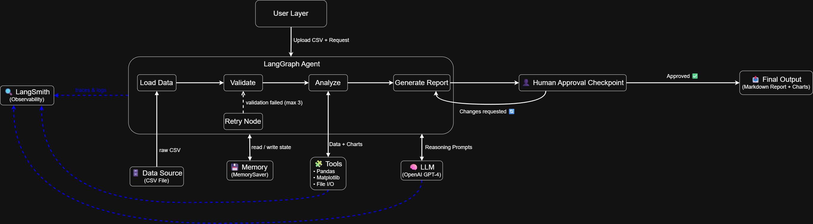

| Layer | Component | Role |
|---|---|---|
| **User Layer** | CSV + Request | Raw dataset and natural-language analysis goal |
| **Agent Core** | LangGraph State Machine | Orchestrates nodes, edges, and state persistence |
| **Brain** | Groq LLM (openai/gpt-oss-120b) | Reasoning, insight extraction, report generation |
| **Tools** | Pandas · Matplotlib · File I/O | Data manipulation, visualization, persistence |
| **Memory** | MemorySaver | Persists state across nodes and retries |
| **Observability** | LangSmith | Traces every decision, tool call, and LLM response |

---

## ✨ Features

- **Fully Autonomous Pipeline:** End-to-end workflow from raw CSV to strategic report — no manual steps after launch.
- **State Machine Orchestration:** Explicit nodes + conditional edges via LangGraph (not a black-box agent loop).
- **Self-Healing with Retry Budget:** Automatic data cleaning on validation failure, capped at `max_retries=3`.
- **Human-in-the-Loop Checkpoint:** Pause, preview, approve, or request revisions with a bounded revision loop.
- **Budget & Loop Guardrails:** `max_revisions=3`, `recursion_limit=30`, and graceful fail paths.
- **Full Observability:** Every node, LLM call, and tool invocation traced in LangSmith.
- **Sub-cent Cost:** Full pipeline runs for ~$0.007 using Groq's free-tier LPU inference.
- **Production-Grade Error Handling:** Absolute paths via `Path(__file__)`, configurable model IDs via `.env`.

---

## 📊 Output Structure

For every run, the agent produces three deliverables in `output/`:

| Deliverable | Description |
|---|---|
| `final_report.md` | Strategic Markdown report (Executive Summary, Content Overview, Geographic Analysis, Genre Analysis, Growth Trends, Recommendations). |
| `execution_log.txt` | Append-only log of every node executed. |
| `*.png` (4 charts) | Type distribution (pie), top countries (bar), yearly growth (line), top genres (horizontal bar). |

**Report preview:**

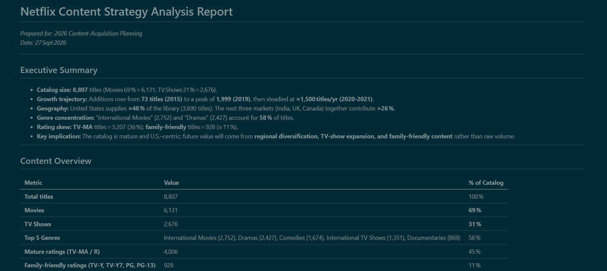

**Generated charts:**

| | |
|:---:|:---:|
| 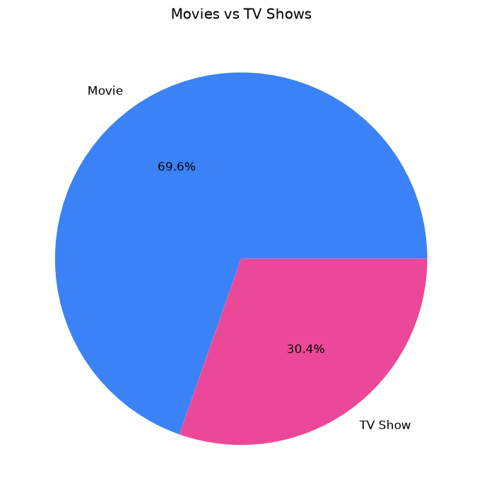 | 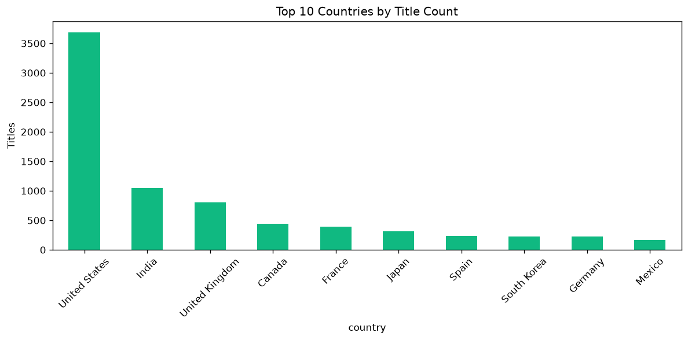 |
| 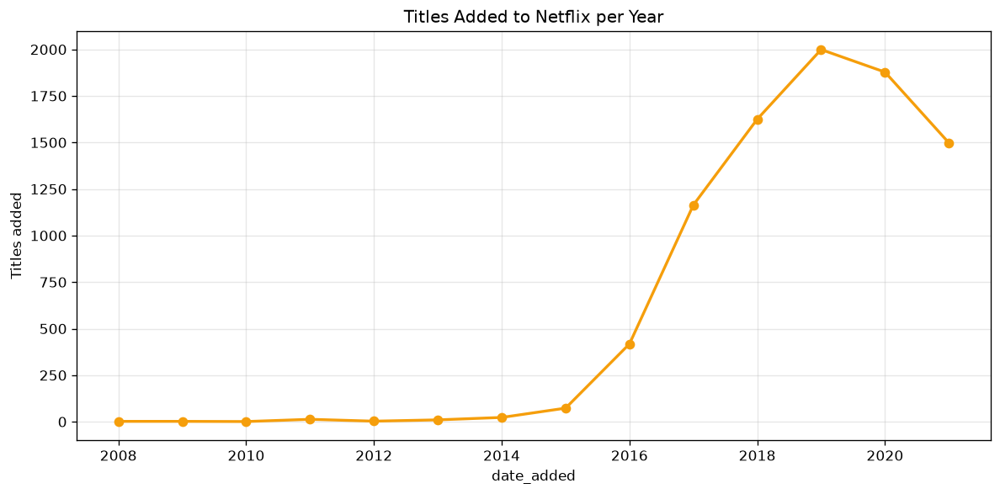 | 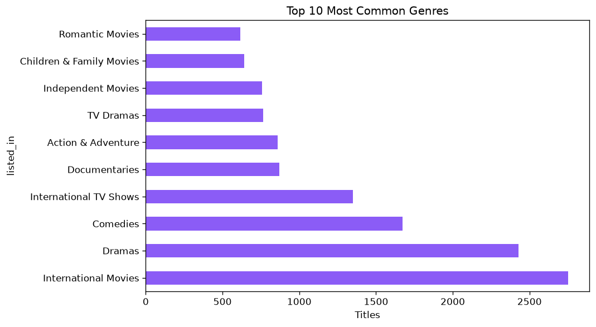 |

---

## 🧠 Models & Tools Used

### 1. LLM Provider: Groq API (openai/gpt-oss-120b)

A 120B-parameter open model running on Groq's LPU hardware for fast, free inference.

| Property | Value |
|---|---|
| Provider | Groq Cloud (free tier) |
| Model ID | `openai/gpt-oss-120b` (configurable via `GROQ_MODEL`) |
| Temperature | 0.3 (balanced creativity vs grounding) |
| Cost per run | ~$0.0024 – $0.0046 |

### 2. Tools (the agent's hands)

| Tool | Role |
|---|---|
| `pandas` | DataFrame loading, statistics, aggregation |
| `matplotlib` | PNG chart generation (headless `Agg` backend) |
| `pathlib` | Absolute path resolution for portability |

### 3. Memory: MemorySaver (LangGraph)

Persistent checkpoint-backed state across nodes. Each `thread_id` preserves full history, enabling replay and branching in future extensions.

---

## 📐 Dataset Info

| Metric | Value |
|---|---|
| Source | [Kaggle — Netflix Movies and TV Shows](https://www.kaggle.com/datasets/shivamb/netflix-shows) |
| File | `data/netflix_titles.csv` |
| Rows | 8,807 titles |
| Columns | 12 (title, type, director, country, date_added, release_year, rating, duration, listed_in, ...) |
| Domain | Streaming content catalog |

---

## 🗂️ Project Structure

```text
week8/
│
├── main.py                 ← Entry point (runs the full agent)
├── check_models.py         ← Diagnostic: list available Groq models
│
├── agents/
│   ├── __init__.py
│   ├── state.py            ← AgentState TypedDict (shared memory)
│   ├── nodes.py            ← All 8 graph nodes
│   └── graph.py            ← LangGraph state machine + conditional edges
│
├── tools/
│   ├── __init__.py
│   └── data_tools.py       ← Pandas + Matplotlib + File I/O helpers
│
├── data/
│   └── netflix_titles.csv  ← The Netflix catalog (Kaggle)
│
├── docs/                   ← Diagrams + trace screenshots
├── output/                 ← Auto-created: report + charts + log
├── .env                    ← API keys (not committed)
├── requirements.txt
└── README.md
```

---

## 🛠️ Installation

1. Clone the repository:

```bash
git clone https://github.com/basmalah-2006/ai_engineer_starter_kit.git
cd ai_engineer_starter_kit/week8
```

2. Create & activate a virtual environment:

```bash
python -m venv .venv
# Windows
.venv\Scripts\activate
# Linux / macOS
source .venv/bin/activate
```

3. Install dependencies:

```bash
pip install -r requirements.txt
```

4. Configure environment variables — create a `.env` file in `week8/`:

```text
GROQ_API_KEY=gsk_your_groq_key_here
GROQ_MODEL=openai/gpt-oss-120b

LANGCHAIN_API_KEY=lsv2_your_langsmith_key_here
LANGCHAIN_TRACING_V2=true
LANGCHAIN_PROJECT=netflix-analysis-agent
LANGCHAIN_ENDPOINT=https://api.smith.langchain.com
```

> 💡 Free API keys: [console.groq.com](https://console.groq.com) and [smith.langchain.com](https://smith.langchain.com)

5. Place the dataset: download `netflix_titles.csv` from Kaggle into `data/`.

---

## ▶️ Running the Agent

```bash
python main.py
```

The agent will:

1. Load & validate the CSV
2. Compute statistics across 6 dimensions
3. Generate 4 charts
4. Draft a strategic report via LLM
5. **Pause at the Human Checkpoint** — type `y` to approve, or free-text feedback to request a revision
6. Save `final_report.md` + `execution_log.txt` + charts to `output/`

**Testing the revision loop:** at the checkpoint, type feedback such as:
*"Make it shorter and add a section about Middle East expansion opportunities."*
The agent loops back to `generate_report`, incorporates the feedback, and re-presents the draft.

---

## 🔄 How It Works (Activity Diagram)

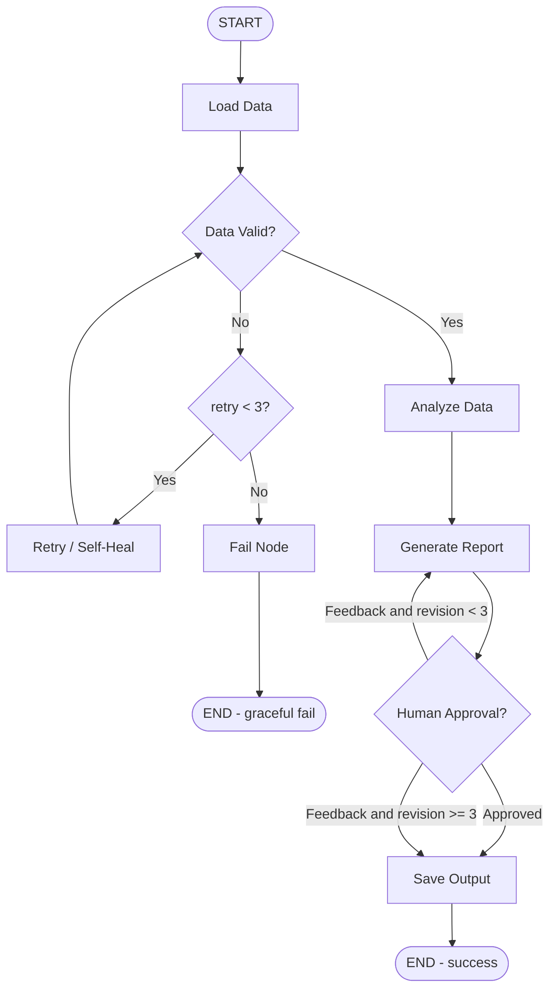

---

## 🧭 Agentic Pattern Choice (LO 8.1)

Following the Anthropic guide *"Building Effective Agents"*, we evaluated three patterns before committing:

| Pattern | Description | Our Verdict |
|---|---|---|
| **Pure Chatbot** | Single-turn LLM, no tools | ❌ Cannot analyze real data |
| **Fixed Workflow (DAG)** | Linear pipeline, no branching | ❌ Cannot self-heal on bad data |
| **Agentic Workflow (State Machine)** | Nodes + conditional edges + retry + human checkpoint | ✅ **Chosen** |

**Why the agentic workflow wins here:** data can be malformed (needs retry edges), reports can be rejected (needs revision loops), high-stakes outputs need human-in-the-loop, and every step must be traceable for debugging.

---

## 🏛️ Framework Choice: LangGraph vs CrewAI (LO 8.2 & 8.3)

| Factor | LangGraph | CrewAI | Winner |
|---|---|---|---|
| Control over flow | Explicit nodes + edges | Implicit role delegation | ✅ LangGraph |
| Deterministic retry | Native conditional edges | Limited | ✅ LangGraph |
| Human-in-the-loop | Native checkpoints | Partial | ✅ LangGraph |
| State persistence | Built-in MemorySaver | Limited | ✅ LangGraph |
| Observability (LangSmith) | First-class integration | Weaker integration | ✅ LangGraph |
| Ease of multi-agent teams | Manual wiring | Native role-based crews | ✅ CrewAI |
| Cost efficiency | Fewer LLM calls | Inter-agent chatter = more tokens | ✅ LangGraph |
| Rapid prototyping | Steeper curve | Faster setup | ✅ CrewAI |

### The Deciding Factor

This project's primary complexity axis is **reliability and observability** (guardrails, retries, tracing), not multi-agent collaboration. LangGraph's state-machine model maps 1:1 to our architecture diagram and gives us explicit conditional edges, persistent memory, first-class LangSmith integration, and sub-cent runs.

**When we'd choose CrewAI instead:** a content-pipeline crew (researcher → writer → editor → reviewer) where value comes from *role diversity and debate*, not deterministic control.

> **Engineering Takeaway:** framework choice should follow the project's primary complexity axis. Reliability-heavy → LangGraph. Role-diversity-heavy → CrewAI.

---

## 🔍 Tracing & Observability (LO 8.5)

Every run is fully traced in **LangSmith**:

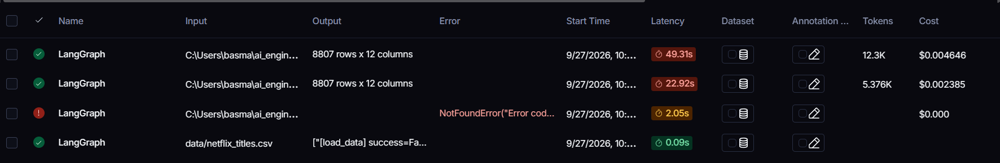

### Success Criteria (how this agent is evaluated)

A run is considered successful when **ALL** of the following hold:

1. `final_report.md` written to `output/`
2. Human approved the report at the checkpoint
3. Total latency < 60 seconds
4. Total cost < $0.01
5. Zero unhandled exceptions (failures must be graceful)

### Live Run Comparison

| Run | Latency | Tokens | Cost | Outcome |
|---|---|---|---|---|
| Revision loop (full path) | 49.31s | 12.3K | $0.0046 | ✅ Success |
| Happy path | 22.92s | 5.4K | $0.0024 | ✅ Success |
| Model 404 failure | 2.05s | 0 | $0.00 | ❌ Graceful fail |
| File-not-found failure | 0.09s | 0 | $0.00 | ❌ Graceful fail |

**Inside the revision loop — how the agent plans, acts, and revises:**

| Full Trace Tree | Zoomed-in Node Detail |
|:---:|:---:|
| 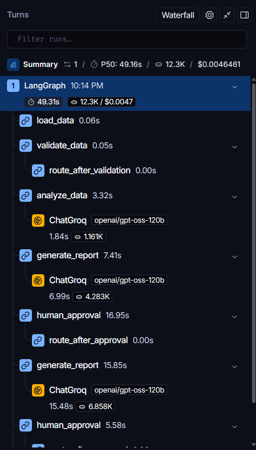 | 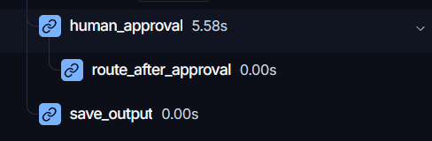 |

**Inside an LLM call — the exact prompt and response captured by LangSmith:**

| Input (prompt sent to Groq) | Output (model response) |
|:---:|:---:|
| 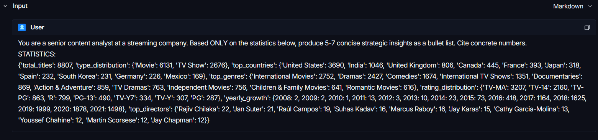 | 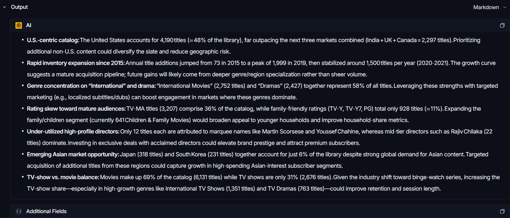 |

> **Observation:** both successful runs meet all 5 success criteria, and failed runs exit cleanly via `fail_node` instead of crashing or looping forever.

---

## 🛡️ Key Design Choices & Guardrails (LO 8.4)

### 1. Budget & loop guardrails

| Guardrail | Value | Prevents |
|---|---|---|
| `max_retries` | 3 | Infinite self-healing loops on broken data |
| `max_revisions` | 3 | Infinite human-feedback loops |
| `recursion_limit` | 30 | Global hard stop for runaway graphs |

### 2. Absolute path resolution

All file paths resolve via `Path(__file__).resolve().parent` instead of relative paths, preventing the classic CWD bug where `data/netflix_titles.csv` resolves differently depending on where the user launches the script.

### 3. Configurable model ID

The LLM model ID is read from `GROQ_MODEL` in `.env`, never hardcoded. When Groq retires a model (as happened with `llama-3.3-70b-versatile` mid-development), we swap one env variable instead of editing source code.

### 4. Graceful failure

Every failure path ends at `fail_node → END`. The agent never crashes; it reports a clear error and exits cleanly, with all intermediate state persisted in LangSmith for post-mortem.

---

## 🐛 Failures Encountered & Fixes Applied

### Failure #1 — FileNotFoundError (relative path bug)

**What happened:** the first run failed with `No such file or directory: 'data/netflix_titles.csv'`. The retry mechanism triggered 3 times, then the agent exited gracefully via `fail_node`.

**How the failure manifested — input vs output:**

| Input (the request) | Output (the error) |
|:---:|:---:|
| 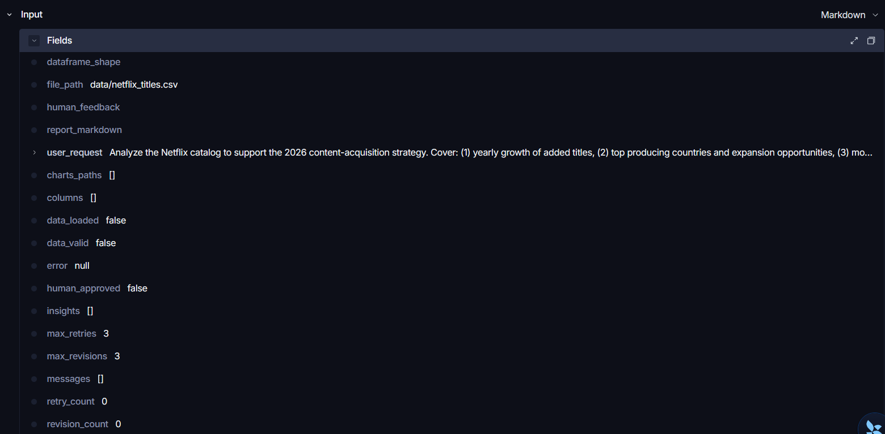 | 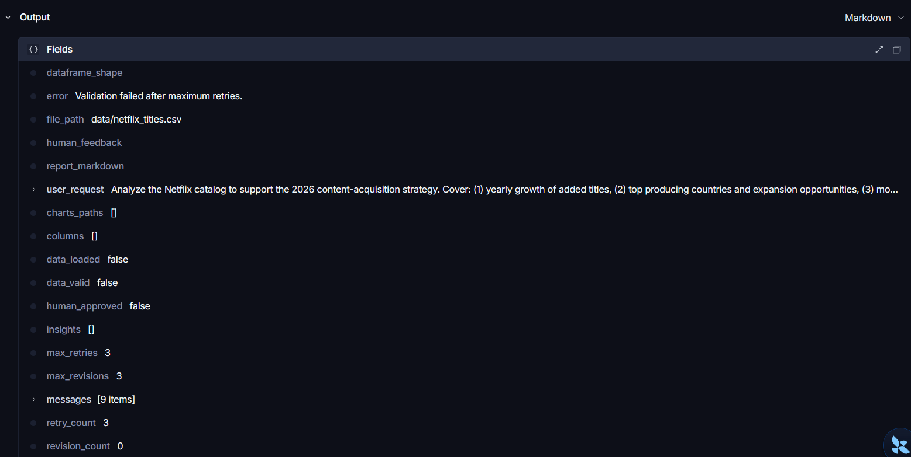 |

**Root cause:** relative paths resolved against the current working directory, not the project folder.

**The fix:** replaced all relative paths with `Path(__file__).resolve().parent / ...`, making them absolute and location-independent.

**Engineering lesson:** never use relative paths in production code — always anchor to `__file__`.

### Failure #2 — groq.NotFoundError: 404 model_not_found

**What happened:** the agent crashed at the first LLM call because `llama-3.3-70b-versatile` had been retired by Groq.

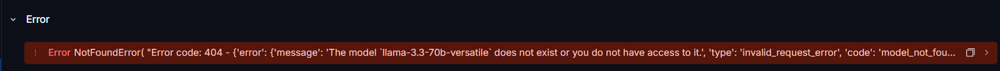

**Root cause:** hardcoded external service identifiers create brittle code that breaks when providers deprecate models.

**The fix:** moved the model ID to `.env` as `GROQ_MODEL`, and added `check_models.py` — a diagnostic script that lists available models before pinning one.

**Engineering lesson:** never hardcode external service identifiers — make them configurable.

### Failure #3 (preventive) — potential infinite revision loop

**What could have happened:** an indecisive reviewer could reject the report forever, consuming tokens indefinitely.

**The guardrail:** `max_revisions=3` plus `revision_count` tracking; the `route_after_approval` conditional edge forces `save_output` after 3 rejections regardless of human input.

**Engineering lesson:** every agent needs explicit stopping conditions — guardrails are not optional in production.

---

## 🎯 Week 8 Learning Outcomes Alignment

| LO | Statement | How We Met It |
|---|---|---|
| **LO 8.1** | Explain core agentic patterns | Chose agentic workflow (state machine) over chatbot, fixed workflow, and CrewAI, with documented rationale. |
| **LO 8.2** | Build stateful agent with branching, retries, recovery | 8 nodes, conditional retry edge, revision loop, persistent MemorySaver. |
| **LO 8.3** | Build role-based multi-agent system | Evaluated CrewAI; chose LangGraph for a reliability-first task. Multi-agent critic extension planned. |
| **LO 8.4** | Add tools, memory, stopping conditions | Pandas/Matplotlib tools, MemorySaver memory, max_retries=3, max_revisions=3, recursion_limit=30. |
| **LO 8.5** | Evaluate & debug agents via tracing | LangSmith integration, 5 success criteria, 4 documented runs (2 success, 2 graceful fail). |

---

## 🔮 Future Extensions

- [ ] **Streamlit web UI** — replace the CLI checkpoint with a browser-based approval form
- [ ] **Multi-agent crew** — add a Critic agent that reviews the draft before the human sees it
- [ ] **Web search tool** — pull competitor data (Disney+, HBO) for comparative analysis
- [ ] **Deploy to Streamlit Community Cloud** — ship a public demo link
- [ ] **Unit tests** — one test per node for regression safety

---

## 🔒 Reliability Notes

- `.env` is gitignored — API keys are never committed.
- `output/` is auto-created and gitignored (reproducible runs).
- Matplotlib uses the `Agg` backend — works on headless servers.
- All pandas operations are wrapped in try/except with state updates.
- The graph is compiled once and reused across runs within the same process.

---

## Author

**Basmalah Ahmed**
AI Engineer Starter Kit — Week 8

*Built with 💪 using LangGraph + Groq + LangSmith — the 2026 agentic stack.*